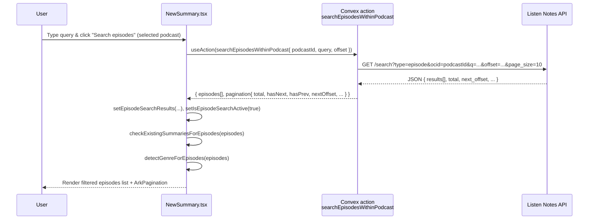

## Feature Plan: Episode Search Within Selected Podcast

### 1. Problem & Goal

When a user selects a podcast on `dashboard/new-summary`, they see paginated episodes fetched from Listen Notes (`GET /podcasts/{id}`). For large shows, scrolling + date-based pagination is painful if the user is hunting for a specific topic/guest. There is also a strict search quota system: top-level podcast/episode searches increment quota via `internal.users.checkUserAccessAndQuota` + `incrementSearchCount`, but **episode search inside a selected podcast must be free**.

**Goal:** Add an **episode search bar scoped to the currently selected podcast** on `new-summary`, backed by a dedicated Convex action that:

- Uses Listen Notes `/search` with `type=episode` + `ocid=<podcastId>`
- Does **not** call `checkUserAccessAndQuota` or `incrementSearchCount`
- Paginates via `offset`/`next_offset`
- Integrates into the existing episode list UI, summaries, transcripts, enhancements, and `ArkPagination`

This corresponds directly to the PRD in `docs/feature-episode-search-prd.md`.

---

### 2. Current Architecture (Relevant Pieces)

#### 2.1 Backend (Convex)

- `convex/users.ts`
  - Centralized quota & subscription logic:
    - `checkUserAccessAndQuota({ featureType: "summary" | "search" })`
      - Enforces free vs paid limits.
      - Increments not here, but blocks when usage ≥ plan limit.
    - `incrementSearchCount` / `incrementSummaryCount`
      - Actually bump counters after a paid operation.
    - `getUserQuota`
      - Used by UI to display search & summary usage.
- `convex/podcasts.ts`
  - `searchPodcasts` (podcast-level search)
    - Args: `query`, `offset?`, `limit?`, `isPagination?`.
    - For **new** searches (`!isPagination`):
      - Runs `internal.users.checkUserAccessAndQuota({ featureType: "search" })`.
      - After successful search, runs `internal.users.incrementSearchCount`.
    - For pagination (`isPagination === true`):
      - Skips both quota check and increment.
    - Uses Listen Notes `/search` with `type=podcast`, `offset`, `page_size`.
    - Returns raw API payload + normalized `pagination`:
      - `offset`, `limit`, `total`, `hasNext`, `hasPrev`, `nextOffset`, `currentPage`, `totalPages`.
  - `getPodcastEpisodes`
    - Args: `{ podcastId: string, nextEpisodePubDate?: number }`.
    - Calls Listen Notes `GET /podcasts/{id}?sort=recent_first[&next_episode_pub_date=...]`.
    - API returns `episodes` + `next_episode_pub_date` + `total_episodes`.
    - Wraps response with `pagination`:
      - `hasNext`, `hasPrev`, `nextEpisodePubDate`, `currentEpisodePubDate`, `total`, `currentCount`.
    - **Important:** This is date-based pagination, not offset-based.
  - `searchEpisodes`
    - Global episode search **that DOES consume quota**:
      - Calls `checkUserAccessAndQuota({ featureType: "search" })`.
      - Uses `/search?type=episode`.
      - Returns raw Listen Notes payload + offset-based `pagination`.
      - Calls `incrementSearchCount` after success.
    - This must **not** be reused for “within a podcast” search, because that must be free and scoped via `ocid`.

#### 2.2 Frontend (React Router v7 + Convex + Clerk)

- Route: `app/routes/dashboard/new-summary.tsx`
  - Uses `type Route = "./+types/new-summary"` React Router v7 framework mode types.
  - Convex hooks:
    - `useAction(api.podcasts.searchPodcasts)` for top-level podcast search.
    - `useAction(api.podcasts.getPodcastEpisodes)` for episodes of a selected podcast.
    - Many actions/mutations for summaries, transcripts, Notion export, genre detection, etc.
  - Quota:
    - `const userQuota = useQuery(api.users.getUserQuota, userReady ? undefined : "skip");`
    - Renders **separate** summary and search quota indicators at top.
  - Podcast search UI:
    - Local state: `searchQuery`, `podcastResults`, `isLoading`, `currentPage`.
    - `handleSearch(page = 1, isNewSearch = true)`:
      - Builds `searchParams = { query, offset, limit: 10, isPagination: !isNewSearch }`.
      - Calls Convex `searchPodcasts`.
      - For new search: resets `selectedPodcast`, `episodes`.
    - Pagination: `ArkPagination` using `podcastResults.pagination`.
  - Podcast selection + episodes:
    - `selectedPodcast`, `episodes`, `episodePage`, `episodePaginationHistory`.
    - `handlePodcastSelect(podcast)`:
      - Sets `selectedPodcast`.
      - Calls `getPodcastEpisodes({ podcastId: podcast.id })`.
      - On result:
        - Saves to `episodes`.
        - Calls:
          - `checkExistingSummariesForEpisodes(podcastData.episodes)`
          - `detectGenreForEpisodes(podcastData.episodes)`
    - `handleEpisodeNavigation('next' | 'prev')`:
      - Uses `episodes.pagination.nextEpisodePubDate` and `episodePaginationHistory` to do date-based paging.
      - Recomputes `episodes`, `episodePage`, and re-runs summary/genre detection.
  - Episode list card:
    - Renders from `episodes.episodes`:
      - Uses `episode.title`, `episode.description` (HTML stripped), `episode.audio_length_sec`, `episode.pub_date_ms`.
      - Enhanced audio player expects `episode.audio`, `episode.id`, and `selectedPodcast` metadata.
      - Summary generation, transcripts, insights toggling, copy buttons, etc., all keyed by `episode.id` and independent of **where** the episode came from (search vs base list) as long as the shape is consistent.
  - “Back to podcasts”:
    - In episodes block:
      - `onClick={() => { setSelectedPodcast(null); setEpisodes(null); }}`
    - This preserves `podcastResults` in state, so going back does **not** redo the top-level search (no extra quota hit).

- UI components:
  - `app/components/blocks/search-bar.tsx`
    - Pattern for search bar + sort dropdown + scrollable results.
    - Uses `Input`, `DropdownMenu`, `Button`, `ScrollArea`, lucide `Search` icon.
    - Good reference for **styling and layout** of an input with an inline icon; we won’t reuse logic directly.
  - `app/components/ui/ark-pagination.tsx`
    - Wraps `@ark-ui/react/pagination`.
    - Props: `count`, `pageSize`, `currentPage`, `onPageChange`.
    - Used already for:
      - Podcast search results (`offset`-based).
      - Episodes pagination (`date`-based but adapted to pages).

---

### 3. New Backend API: `searchEpisodesWithinPodcast`

#### 3.1 Shape & Semantics

- **Location:** `convex/podcasts.ts`.
- **Name:** `searchEpisodesWithinPodcast` (Convex `action`).
- **Args:**
  - `query: string` – user-entered search string.
  - `podcastId: string` – Listen Notes podcast ID (same as used in `getPodcastEpisodes`).
  - `offset?: number` – offset into results (default `0`).
  - `limit?: number` – page size (cap at 10).
- **Behavior:**
  - Call Listen Notes `GET /search` with:
    - `q=${encodeURIComponent(query)}`
    - `type=episode`
    - `ocid=${podcastId}`
    - `offset=${offset}`
    - `page_size=${limit}`
    - `safe_mode=0` (or keep consistent with other search calls).
  - **No** calls to:
    - `internal.users.checkUserAccessAndQuota`
    - `internal.users.incrementSearchCount`
  - Require normal Convex auth implicitly:
    - If we want to ensure only authenticated users use it, we can:
      - Option A (simple): rely on frontend gating (page already behind Clerk) and not check again.
      - Option B (stricter, recommended): inside handler:
        - `const identity = await ctx.auth.getUserIdentity(); if (!identity) throw new Error("Not authenticated");`
      - Plan: **Option B** to mirror other paid features while keeping this feature quota-free.
  - Map Listen Notes search results into a minimal episode shape matching what `new-summary.tsx` expects.

#### 3.2 Result Shape

The base `/search` response for episodes includes (per docs / scrape):

- `results[]` with fields like:
  - `id`
  - `title_original`
  - `description_original`
  - `audio`
  - `audio_length_sec`
  - `pub_date_ms`
  - `thumbnail`, etc.
- `count`, `total`, `next_offset`.

We want to return:

```ts
type PodcastScopedEpisode = {
  id: string;
  title: string;
  description: string;
  audio: string;
  audio_length_sec: number;
  pub_date_ms: number;
  // Optional extras we might pass through:
  thumbnail?: string;
  podcast_id?: string;
};

type EpisodeSearchPagination = {
  offset: number;
  limit: number;
  total: number;
  hasNext: boolean;
  hasPrev: boolean;
  nextOffset: number | null;
  currentPage: number;
  totalPages: number;
};

type SearchEpisodesWithinPodcastResult = {
  episodes: PodcastScopedEpisode[];
  pagination: EpisodeSearchPagination;
};
```

Key points:

- **Normalize** to `episodes[]` (not `results[]`) so frontend can share list UI with `getPodcastEpisodes`.
- Pagination derived from `offset`, `limit`, `total`, `next_offset` just like `searchPodcasts`.

#### 3.3 Pseudocode (Convex action)

```ts
export const searchEpisodesWithinPodcast = action({
  args: {
    query: v.string(),
    podcastId: v.string(),
    offset: v.optional(v.number()),
    limit: v.optional(v.number()),
  },
  handler: async (ctx, args) => {
    const identity = await ctx.auth.getUserIdentity();
    if (!identity) {
      throw new Error("Not authenticated");
    }

    const offset = args.offset ?? 0;
    const limit = Math.min(args.limit ?? 10, 10);

    const apiKey =
      process.env.LISTEN_NOTES_API_KEY ?? process.env.LISTEN_API_KEY;
    if (!apiKey) {
      throw new Error(
        "Listen Notes API key missing. Set LISTEN_NOTES_API_KEY or LISTEN_API_KEY."
      );
    }

    const url =
      "https://listen-api.listennotes.com/api/v2/search" +
      `?q=${encodeURIComponent(args.query)}` +
      "&type=episode" +
      `&ocid=${args.podcastId}` +
      `&offset=${offset}` +
      `&page_size=${limit}` +
      "&safe_mode=0";

    const response = await fetch(url, {
      headers: {
        "X-ListenAPI-Key": apiKey,
      },
    });

    if (!response.ok) {
      throw new Error(`API request failed: ${response.status}`);
    }

    const data = await response.json();

    const episodes: PodcastScopedEpisode[] = (data.results ?? []).map(
      (ep: any) => ({
        id: ep.id,
        title: ep.title_original ?? ep.title ?? "",
        description: ep.description_original ?? ep.description ?? "",
        audio: ep.audio,
        audio_length_sec: ep.audio_length_sec ?? 0,
        pub_date_ms: ep.pub_date_ms ?? 0,
        thumbnail: ep.thumbnail,
        podcast_id: ep.podcast_id,
      })
    );

    const total = data.total ?? episodes.length;
    const nextOffset = typeof data.next_offset === "number"
      ? data.next_offset
      : null;

    return {
      episodes,
      pagination: {
        offset,
        limit,
        total,
        hasNext:
          typeof data.next_offset === "number" &&
          data.next_offset >= 0 &&
          episodes.length > 0 &&
          offset + episodes.length < total,
        hasPrev: offset > 0,
        nextOffset,
        currentPage: Math.floor(offset / limit) + 1,
        totalPages: Math.ceil(total / limit),
      },
    } satisfies SearchEpisodesWithinPodcastResult;
  },
});
```

**Quota policy:** intentionally **no calls** to `checkUserAccessAndQuota` or `incrementSearchCount`. This ensures:

- Top-level search (podcasts / global episodes) still respects quotas.
- In-podcast episode search is “free”, but still requires auth.

---

### 4. Frontend Design: `new-summary.tsx` Changes

#### 4.1 New State

Add the following to `NewSummary` component state:

```ts
const [episodeSearchQuery, setEpisodeSearchQuery] = useState("");
const [episodeSearchResults, setEpisodeSearchResults] = useState<any | null>(null);
const [isEpisodeSearchActive, setIsEpisodeSearchActive] = useState(false);
const [episodeSearchPage, setEpisodeSearchPage] = useState(1);
const [episodeSearchLoading, setEpisodeSearchLoading] = useState(false);
const [episodeSearchError, setEpisodeSearchError] = useState<string | null>(null);
```

Notes:

- `episodes` continues to store the canonical **full list** for the currently selected podcast (paginated by date).
- `episodeSearchResults` will store the Convex action result:
  - `{ episodes: PodcastScopedEpisode[], pagination: EpisodeSearchPagination }`.
- `isEpisodeSearchActive` toggles whether the episodes UI draws from:
  - `episodes.episodes` (base view) vs
  - `episodeSearchResults.episodes` (search view).
- `episodeSearchPage` is logical page number for offset-based search; we can derive `offset = (page - 1) * limit`.

#### 4.2 Convex hook

Add a hook for the new action:

```ts
const searchEpisodesWithinPodcast = useAction(api.podcasts.searchEpisodesWithinPodcast);
```

#### 4.3 Episode Search Handler

Key requirements from PRD + user instructions:

- **Min query length:** ≥ 2 characters.
- **Debounce server calls** to avoid spam (but still primarily search on explicit submit).
- **No quota impact** (handled by backend design).
- **Scoped to selected podcast** only.

Plan:

- Main handler:

```ts
const EPISODE_PAGE_SIZE = 10;

const performEpisodeSearch = async (page = 1) => {
  if (!selectedPodcast) return;
  const trimmed = episodeSearchQuery.trim();
  if (trimmed.length < 2) return;

  setEpisodeSearchLoading(true);
  setEpisodeSearchError(null);

  try {
    const offset = (page - 1) * EPISODE_PAGE_SIZE;
    const result = await searchEpisodesWithinPodcast({
      query: trimmed,
      podcastId: selectedPodcast.id,
      offset,
      limit: EPISODE_PAGE_SIZE,
    });

    setEpisodeSearchResults(result);
    setIsEpisodeSearchActive(true);
    setEpisodeSearchPage(page);

    // Reuse existing helper functions on new episodes array:
    if (userQuota?.userId && result.episodes) {
      await checkExistingSummariesForEpisodes(result.episodes);
    }
    if (result.episodes) {
      await detectGenreForEpisodes(result.episodes);
    }
  } catch (err: any) {
    console.error("Episode search failed:", err);
    setEpisodeSearchError(err.message ?? "Failed to search episodes. Please try again.");
  } finally {
    setEpisodeSearchLoading(false);
  }
};
```

- Debounce wrapper:
  - We **do not** want to search on *every* keystroke (PRD recommends explicit submit), but we do want to protect the backend from rapid double-clicks / keypresses.
  - Wrap `performEpisodeSearch` with a simple 300ms debounce and call it from:
    - Search button click and Enter key.
  - This way:
    - Fast repeated submissions collapse into a single API call.
    - We still keep UX “submit-based” aligned with PRD.

```ts
const debouncedEpisodeSearch = useMemo(
  () => debounce((page: number) => void performEpisodeSearch(page), 300),
  [performEpisodeSearch]
);
```

Usage:

- On click:

```ts
onClick={() => debouncedEpisodeSearch(1)}
```

- On Enter:

```ts
onKeyDown={(e) => {
  if (e.key === "Enter") {
    e.preventDefault();
    debouncedEpisodeSearch(1);
  }
}}
```

**Note:** Debounce utility can come from `lodash.debounce` or a tiny local helper; the exact import is implementation detail.

#### 4.4 Clear Search

Add a handler:

```ts
const handleClearEpisodeSearch = () => {
  setEpisodeSearchQuery("");
  setEpisodeSearchResults(null);
  setIsEpisodeSearchActive(false);
  setEpisodeSearchPage(1);
  setEpisodeSearchError(null);
};
```

Behavior:

- Resets to the original paginated `episodes` list.
- Does **not** re-fetch episodes (we already have them in `episodes` state).

#### 4.5 Episodes Page Pagination (Search vs Base)

Add a new pagination handler for search results:

```ts
const handleEpisodeSearchPageChange = (page: number) => {
  if (!episodeSearchResults?.pagination) return;
  if (page === episodeSearchPage) return;

  debouncedEpisodeSearch(page);
};
```

Update the episodes pagination rendering:

- Currently:
  - Uses `episodes.pagination` with date-based prev/next and `handleEpisodeNavigation('next' | 'prev')`.
- New logic:
  - If `isEpisodeSearchActive && episodeSearchResults?.pagination`:
    - Use `ArkPagination` with:
      - `count={episodeSearchResults.pagination.total}`
      - `pageSize={EPISODE_PAGE_SIZE}`
      - `currentPage={episodeSearchPage}`
      - `onPageChange={handleEpisodeSearchPageChange}`
  - Else:
    - Use the **existing** `episodes.pagination` + `handleEpisodeNavigation` logic unchanged.

This preserves the existing date-based pagination behavior when not searching, while search uses offset-based pages.

#### 4.6 Updated UI Layout for Episodes Section

Within the `selectedPodcast && (episodes || isLoading)` block, we will:

1. Keep “Back to podcasts” exactly as-is (no new search, no quota).
2. Under the “Episodes (N)” heading, insert the **episode search bar**:

Rough JSX (structure, not final code):

```tsx
{episodes?.episodes && (
  <div className="space-y-4">
    <div className="flex items-center justify-between mb-2">
      <h3 className="text-xl font-semibold text-gray-900">
        Episodes ({episodes.pagination?.total ?? episodes.total_episodes ?? episodes.episodes.length ?? 0})
      </h3>
    </div>

    {/* Episode search bar */}
    <div className="w-full md:w-[60%] max-w-xl flex flex-col sm:flex-row gap-3">
      <div className="relative flex-1">
        <input
          type="text"
          value={episodeSearchQuery}
          onChange={(e) => {
            setEpisodeSearchQuery(e.target.value);
          }}
          onKeyDown={/* Enter handler with debouncedEpisodeSearch(1) */}
          placeholder="Search episodes by title, topic, guest..."
          className="w-full px-4 py-2 pr-10 border border-gray-300 rounded-lg focus:outline-none focus:ring-2 focus:ring-blue-500 focus:border-blue-500 text-gray-900"
        />
        <Search className="absolute right-3 top-1/2 -translate-y-1/2 text-gray-400" size={18} />
      </div>

      <button
        onClick={() => debouncedEpisodeSearch(1)}
        disabled={episodeSearchQuery.trim().length < 2 || episodeSearchLoading || !selectedPodcast}
        className="px-4 py-2 bg-blue-600 text-white font-medium rounded-lg hover:bg-blue-700 disabled:bg-gray-400 disabled:cursor-not-allowed transition-colors"
      >
        {episodeSearchLoading ? "Searching..." : "Search episodes"}
      </button>
    </div>

    {/* Search meta / clear controls */}
    {isEpisodeSearchActive && episodeSearchResults && (
      <div className="flex flex-wrap items-center justify-between gap-3 text-sm text-gray-600 mt-2">
        <span>
          Found {episodeSearchResults.pagination.total} episodes matching "
          {episodeSearchQuery.trim()}"
        </span>
        <div className="flex gap-2">
          <button
            onClick={handleClearEpisodeSearch}
            className="text-blue-600 hover:text-blue-800 font-medium"
          >
            Clear search
          </button>
          <button
            onClick={() => { setSelectedPodcast(null); setEpisodes(null); }}
            className="text-gray-600 hover:text-gray-800"
          >
            ← Back to podcasts
          </button>
        </div>
      </div>
    )}

    {episodeSearchError && (
      <p className="text-sm text-red-600 mt-1">{episodeSearchError}</p>
    )}
  </div>
)}
```

- Styling mirrors `search-bar.tsx`:
  - Input with right-aligned `Search` icon.
  - Same border/radius/spacing patterns.
- **Empty state when no search results:**
  - If `isEpisodeSearchActive && episodeSearchResults && episodeSearchResults.episodes.length === 0`:

```tsx
<div className="flex items-center justify-center py-12">
  <div className="text-center">
    <div className="text-4xl mb-3">🔍</div>
    <p className="text-gray-800 font-semibold">
      No episodes found for "{episodeSearchQuery.trim()}"
    </p>
    <p className="text-gray-500 mt-1">
      Try different keywords or browse all episodes.
    </p>
    <div className="mt-4 flex flex-wrap justify-center gap-3">
      <button
        onClick={handleClearEpisodeSearch}
        className="px-4 py-2 bg-blue-600 text-white rounded-lg hover:bg-blue-700"
      >
        Show All Episodes
      </button>
      <button
        onClick={() => { setSelectedPodcast(null); setEpisodes(null); }}
        className="flex items-center gap-2 text-gray-700 hover:text-gray-900"
      >
        <span>←</span> Back to Podcasts
      </button>
    </div>
  </div>
</div>
```

#### 4.7 Rendering Episodes: Base vs Search

At the point where we map over `episodes.episodes`:

- Introduce a local `const episodesToRender = isEpisodeSearchActive && episodeSearchResults
  ? episodeSearchResults.episodes
  : episodes?.episodes ?? [];`
- Reuse the existing map logic on `episodesToRender`:
  - Same JSX body and interactions (summary generation, transcript, insights, EnhancedAudioPlayer, etc.).
  - All keyed by `episode.id` which is present in both shapes.
- For `EnhancedAudioPlayer`, pass:
  - `episode.title`
  - `episode.audio_length_sec`
  - `episode.pub_date_ms`
  - `episode.audio`
  - Works identically as long as mapping in the Convex action is correct.

This avoids duplicating the enormous episode card component; we only branch **which array** it consumes.

#### 4.8 Interaction With Existing Helpers

- `checkExistingSummariesForEpisodes(episodes[])`:
  - Already parameterized by an episodes array and uses only `episode.id`.
  - Safe to reuse for search results.
- `detectGenreForEpisodes(episodes[])`:
  - Same: uses `episode.title`, `episode.description`, `episode.audio`.
  - Mapping from Listen Notes search results ensures these fields exist.
- Quota banners:
  - Top-level search quota indicator continues to reflect usage from **podcast search** or **global episode search**, not from `searchEpisodesWithinPodcast`.
  - Confirmed because backend for episode-within-podcast search doesn’t increment search count.

---

### 5. Data Flow & Diagrams

#### 5.1 Sequence: Episode Search Within Podcast



#### 5.2 State View (High-Level)

```mermaid
flowchart TD
  SQ[searchQuery (podcasts)] -->|handleSearch| PR[podcastResults]
  PR -->|click podcast| SP[selectedPodcast]

  SP -->|getPodcastEpisodes| EP[episodes (full list)]
  EP -->|base list| UI[Episode List UI]

  SP --> ESQ[episodeSearchQuery]
  ESQ -->|performEpisodeSearch| ESR[episodeSearchResults]
  ESR -->|isEpisodeSearchActive=true| UI

  UI -->|Clear search| EP
  UI -->|Back to podcasts| PR
```

---

### 6. Edge Cases & Error Handling

- **No selected podcast:**
  - Disable episode search button if `!selectedPodcast`.
  - Guard early in `performEpisodeSearch`.
- **Short queries (< 2 chars):**
  - Disable search button.
  - Do not fire debounced call.
  - Optional: show small helper text “Enter at least 2 characters”.
- **No results:**
  - Show dedicated empty state (per PRD) with:
    - “No episodes found for …”
    - `[Show All Episodes]` → `handleClearEpisodeSearch`.
    - `[← Back to Podcasts]` → existing back handler.
- **Listen Notes API errors or 4xx/5xx:**
  - Backend throws error with HTTP status.
  - Frontend catches and displays a red error message above list.
  - Existing episodes list remains in memory; user can clear search to return to it.
- **Quota exhaustion for top-level search:**
  - Behavior unchanged; `searchPodcasts` still checks quota and can throw.
  - Episode search within podcast must **continue to work** even when top-level search quota is exhausted, because it’s not calling quota checks.
- **Rapid submit spam:**
  - Debounce ensures multiple clicks are batched to at most one call within debounce window.

---

### 7. Manual Testing Strategy

This feature is primarily manual-testable in the dashboard UI. Below is a concrete checklist.

#### 7.1 Environment & Setup

- Ensure:
  - Convex deployment running with updated `podcasts.ts`.
  - Frontend build running with updated `new-summary.tsx`.
  - Valid `LISTEN_NOTES_API_KEY` or `LISTEN_API_KEY` present in environment.
  - Test user logged in via Clerk (any plan, including free).

#### 7.2 Backend Tests (Console/Logs)

1. **Top-level podcast search still uses quota:**
   - Use `new-summary` top podcast search box.
   - Verify in Convex logs that:
     - `searchPodcasts` logs `willCheckQuota: true` for new searches.
     - `internal.users.checkUserAccessAndQuota` and `internal.users.incrementSearchCount` are invoked.
2. **Episode search within podcast skips quota:**
   - After selecting a podcast, perform multiple episode searches.
   - Confirm logs show `searchEpisodesWithinPodcast` calls *without* any `checkUserAccessAndQuota` or `incrementSearchCount` for those calls.
3. **Correct Listen Notes query:**
   - Observe logs (or temporarily log URL) and confirm:
     - `type=episode`
     - `ocid=<selected podcast id>`
     - `offset` increments by `10` when paginating.

#### 7.3 UI / Functional Tests

1. **Episode search bar presence & behavior:**
   - Navigate to `Dashboard → New Summary`.
   - Search for a podcast, pick one.
   - Verify:
     - “Back to podcasts” button appears at top of the episodes section.
     - Episodes header (`Episodes (N)`) visible.
     - Episode search bar appears below header:
       - Placeholder: “Search episodes by title, topic, guest...”.
       - Search button text appropriate (e.g. “Search episodes”).
2. **Min query length:**
   - Type 1 character → search button should be disabled.
   - Type 2+ characters → button enabled.
   - Press Enter with 1 char → no request should be sent (confirm via network/Convex logs).
3. **Successful in-podcast search:**
   - Choose a podcast with many episodes (100+ if possible).
   - Enter a term likely matching a subset (e.g. a recurring guest name).
   - Click “Search episodes”.
   - Verify:
     - Loader state (button shows “Searching...” and/or spinner).
     - The episode list now contains only episodes that match the term.
     - Subtitle showing `Found X episodes matching "term"`.
     - `Clear search` button present.
4. **Search pagination:**
   - When total results > 10:
     - `ArkPagination` should show multiple pages based on `total / 10`.
     - Clicking page 2:
       - Calls Convex with `offset=10`.
       - Updates `episodeSearchPage`.
       - New results shown.
     - Navigating back to page 1 re-issues the search or reuses cached data (depending on implementation).
5. **Clear search behavior:**
   - After searching, click “Clear search”.
   - Verify:
     - Search input cleared.
     - `isEpisodeSearchActive` false.
     - Episode list reverts to the base `episodes.episodes` view (recent-first, date-paginated).
     - Existing summary badges, toggles, and audio playback still function.
6. **Empty state:**
   - Enter a very specific term that yields no episodes for that podcast.
   - Confirm:
     - Empty state UI with “No episodes found for ...” appears.
     - “Show All Episodes” returns you to base list.
     - “Back to Podcasts” returns you to podcast results without re-searching.
7. **Quota invariants:**
   - Note the current search quota banner (e.g. `used/limit searches`).
   - Perform:
     - 1 new **top-level** podcast search → used count increments by 1.
     - Several pages of top-level pagination → count does not increment.
     - Several episode-within-podcast searches and paginations:
       - **Search used count must not change.**
8. **Summary & transcript integration:**
   - In search results:
     - Click “Generate Summary” on a matching episode.
     - Confirm summary renders and behaves the same as from the base list.
     - If transcripts are available, “Show Transcript” still works.
     - Copy buttons still work and show “Copied!” state.

#### 7.4 Regression Tests

1. **Base episodes pagination still works:**
   - Without using episode search, verify next/prev episode paging still functions using `nextEpisodePubDate` and `episodePaginationHistory`.
2. **Back to podcasts preserves results:**
   - Perform a podcast search.
   - Select a podcast, then back to podcasts.
   - Verify:
     - Podcast list is exactly the same as before.
     - No extra quota usage occurred.
3. **Auth gate:**
   - While logged out, navigate to the dashboard/new-summary route.
   - Confirm app redirects to sign-in (existing Clerk + React Router behavior).
   - After sign-in, confirm both top-level and episode search features work.

---

### 8. Open Questions / Implementation Notes

These are decisions you may want to confirm before coding, but the plan assumes reasonable defaults:

- **Debounce strategy:** This plan debounces the **server call** around explicit submissions (button / Enter) to reduce accidental spam, rather than live “search as you type” to keep API usage low. If you want true typeahead, we’d:
  - Trigger `debouncedEpisodeSearch(1)` from `onChange` once `length >= 2` and the user stops typing for 300–500ms.
  - Keep explicit button for accessibility.
- **Case sensitivity / matching:** We rely entirely on Listen Notes full-text search relevance; no client-side filtering beyond that.
- **Result highlighting:** Out of scope for v1 (per PRD); can be added later via simple string highlighting in `title`/`description`.
- **Notion export for search results:** If/when Notion export is wired into episode cards for search results, ensure `handleExportToNotion` uses the episode object passed in, not only `episodes.episodes.find(...)`, or update it to also search `episodeSearchResults.episodes`.

This plan should give any engineer enough context to implement the feature end-to-end while keeping behavior tightly aligned with the PRD and existing quota/UX patterns.

